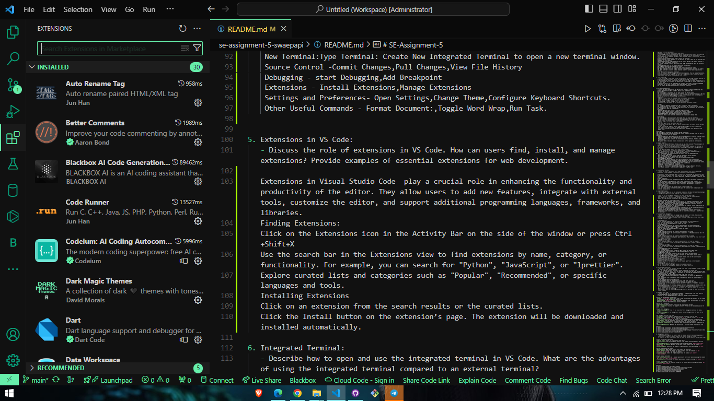

# SE-Assignment-5
Installation and Navigation of Visual Studio Code (VS Code)
 Instructions:
Answer the following questions based on your understanding of the installation and navigation of Visual Studio Code (VS Code). Provide detailed explanations and examples where appropriate.

 Questions:

1. Installation of VS Code:
   - Describe the steps to download and install Visual Studio Code on Windows 11 operating system. Include any prerequisites that might be needed.

   Open your preferred web browser.
   Navigate to the official Visual Studio Code website 
   On the homepage, you will see a download button that automatically detects your operating system. Click the "Download for Windows" button to download the VS Code installer
   Once the download is complete, navigate to your Downloads folder or the location where the installer was saved.
   Double-click the VSCodeUserSetup file to launch the installer.
   Read through the license agreement. If you agree to the terms, check the box to accept the agreement and click “Next.”
   Choose the destination folder where you want to install VS Code. The default location is usually fine. Click “Next” to continue.
   You will be prompted to select additional tasks. It’s recommended to check the following options:
   Create a desktop icon” (if you want a shortcut on your desktop).
   Add to PATH” (important for command line usage).
   Register Code as an editor for supported file types” (optional but useful).
   Add 'Open with Code' action to Windows Explorer file context menu” (optional but useful).
   Add 'Open with Code' action to Windows Explorer directory context menu” (optional but useful).
   Click “Next” after making your selections.
   Click the “Install” button to begin the installation process. This may take a few minutes.
   Once the installation is complete, you will see a completion screen. Ensure the “Launch Visual Studio Code” option is checked and click “Finish.”

2. First-time Setup:
   - After installing VS Code, what initial configurations and settings should be adjusted for an optimal coding environment? Mention any important settings or extensions.
   If you checked the “Launch Visual Studio Code” option, VS Code will open automatically. If not, you can open it by clicking the desktop icon or searching for “Visual Studio Code” in the Start menu.
   On the first launch, you may be prompted to customize your setup or install recommended extensions. You can skip or complete these steps based on your preferences.
   You can enhance VS Code’s functionality by installing extensions.

3. User Interface Overview:
   - Explain the main components of the VS Code user interface. Identify and describe the purpose of the Activity Bar, Side Bar, Editor Group, and Status Bar.
   Activity Bar 
   The Activity Bar is located on the far left side of the VS Code window
   The Activity Bar provides quick access to different views and primary functions in VS Code. Each icon in the Activity Bar represents a view or functionality, such as the Explorer, Search, Source Control, Run and Debug, and Extensions.
   Components:
    Explorer (Files): Shows the file and folder structure of your project.
    Search: Allows you to search across files in your workspace.
    Source Control: Manages version control, typically with Git.
    Run and Debug: Provides debugging tools and configurations.
    Extensions: Lets you search for and install extensions to enhance VS Code.

   Side Bar 
   The Side Bar is adjacent to the Activity Bar, on the left side of the window.
   The Side Bar displays the contents and tools related to the currently selected activity from the Activity Bar. For instance, if the Explorer icon is selected in the Activity Bar, the Side Bar will show the file explorer.
   Components
    Explorer: Displays your project's file and folder structure.
    Search Panel: Provides a search interface to find text within files.
    Source Control Panel: Manages repositories and displays changes.
    Run and Debug Panel: Shows debug configurations and controls.
    Extensions Panel: Lists installed extensions and allows you to manage them.

   Editor Group
   The Editor Group is the central area of VS Code where you open and edit files.
   The Editor Group is where the main content editing happens. You can open multiple files side by side or in separate tabs. VS Code supports splitting the editor into multiple groups to compare or work on files simultaneously.
   Features:
    Tabs: Each open file is represented by a tab.
    Split Editor: Allows you to split the editor horizontally or vertically to view multiple files at once.
    Syntax Highlighting: Supports various programming languages for better readability.
    Code Folding: Lets you collapse and expand code sections.
    IntelliSense: Provides intelligent code completions, parameter info, quick info, and member lists.

 Status Bar
 The Status Bar is located at the bottom of the VS Code window.
 The Status Bar provides information about the current workspace and open files, as well as shortcuts to various tools and settings.
 Components:
    Information Display: Shows details like the current Git branch, encoding, line and column numbers, language mode, and problems/errors in the code.
    Shortcuts: Offers quick access to key functionalities like terminal, feedback, and notifications.
    Background Tasks: Indicates ongoing processes such as file uploads or installations.

4. Command Palette:
   - What is the Command Palette in VS Code, and how can it be accessed? Provide examples of common tasks that can be performed using the Command Palette.
   The Command Palette  provides quick access to a wide range of commands and settings. It allows you to execute various tasks without navigating through menus or using keyboard shortcuts.
   You can open the Command Palette in VS Code in several ways:
    Keyboard Shortcut:Press Ctrl+Shift+P (Windows/Linux) or Cmd+Shift+P (Mac).    
    Menu Navigation:Click on View in the top menu bar, then select Command Palette....
    Quick Access:Press F1 to open the Command Palette directly.
  Here are some examples of common tasks you can perform using the Command Palette:
    File and Project Management
    Open File:Type Open File to quickly find and open a file in your project.
    Save All:Type Save All to save all open files at once.
    Close Folder:Type Close Folder to close the current workspace folder.
   Editor and Window Management
    Split Editor:Type Split Editor to split the current editor into multiple views.
    Toggle Sidebar Visibility:Type Toggle Sidebar Visibility to show or hide the sidebar.
    New Terminal:Type Terminal: Create New Integrated Terminal to open a new terminal window.
    Source Control -Commit Changes,Pull Changes,View File History
    Debugging - start Debugging,Add Breakpoint
    Extensions - Install Extensions,Manage Extensions
    Settings and Preferences- Open Settings,Change Theme,Configure Keyboard Shortcuts.
    Other Useful Commands - Format Document:,Toggle Word Wrap,Run Task.

5. Extensions in VS Code:
   - Discuss the role of extensions in VS Code. How can users find, install, and manage extensions? Provide examples of essential extensions for web development.
   
   Extensions in Visual Studio Code  play a crucial role in enhancing the functionality and productivity of the editor. They allow users to add new features, integrate with external tools, customize the editor, and support additional programming languages, frameworks, and libraries.
   Finding Extensions:
   Click on the Extensions icon in the Activity Bar on the side of the window or press Ctrl+Shift+X
   Use the search bar in the Extensions view to find extensions by name, category, or functionality. For example, you can search for "Python", "JavaScript", or "lprettier".
   Explore curated lists and categories such as "Popular", "Recommended", or specific languages and tools.
   Installing Extensions
   Click on an extension from the search results or the curated lists.
   Click the Install button on the extension’s page. The extension will be downloaded and installed automatically.
   

6. Integrated Terminal:
   - Describe how to open and use the integrated terminal in VS Code. What are the advantages of using the integrated terminal compared to an external terminal?

   To open and use the integrated terminal in VS Code, follow these steps:
    Keyboard Shortcut: Press Ctrl +  (backtick) to show or hide the Terminal window.
    Menu Command: Go to View > Terminal to open the Terminal.
    Search Bar: Type terminal in the search bar to open the Terminal.

  Advantages of Using the Integrated Terminal
    Convenience: The integrated terminal allows you to run commands directly within the VS Code window, eliminating the need to switch between multiple windows or applications.
    Contextual: The terminal is integrated with the VS Code editor, making it easier to navigate and manage files while running commands.
    Customization: The terminal can be customized with key bindings, styles, and settings to enhance its functionality and usability.
    Multi-Instance Support: Multiple instances of the Terminal can be opened simultaneously, allowing you to manage different tasks and projects efficiently.
    Integration with VS Code Features: The integrated terminal supports features like IntelliSense code completion, debugging, and Git integration, making it a powerful tool for developers

7. File and Folder Management:
   - Explain how to create, open, and manage files and folders in VS Code. How can users navigate between different files and directories efficiently?
   To create, open, and manage files and folders in Visual Studio Code , follow these steps:
   Creating Files and Folders

   Create a New File:
   Open VS Code and navigate to the directory where you want to create a new file.
   Press Ctrl + N (Windows/Linux) or Cmd + N (Mac) to create a new file.
   Enter the file name and press Enter to create the file.
   Create a New Folder:
   Open VS Code and navigate to the directory where you want to create a new folder.
   Right-click in the Explorer panel and select "New Folder" or press Ctrl + Shift + N (Windows/Linux) or Cmd + Shift + N (Mac).
   Enter the folder name and press Enter to create the folder.
   Opening Files and Folders
   Open a File:
   Open VS Code and navigate to the directory where the file is located.
   Double-click the file in the Explorer panel or press Ctrl + O (Windows/Linux) or Cmd + O (Mac) to open the file.
   Open a Folder:
   Open VS Code and navigate to the directory where the folder is located.
   Right-click the folder in the Explorer panel and select "Open Folder" or press Ctrl + Shift + O   to open the folder.
   Managing Files and Folders
   Rename a File or Folder:
   Open VS Code and navigate to the directory where the file or folder is located.
   Right-click the file or folder in the Explorer panel and select "Rename" or press F2 to rename it.
   Delete a File or Folder:
   Open VS Code and navigate to the directory where the file or folder is located.
   Right-click the file or folder in the Explorer panel and select "Delete" or press Delete to delete it.
   Navigating Between Files and Directories
   Quick File Navigation:
   Press Ctrl + P (Windows/Linux) or Cmd + P (Mac) to open the Quick Open panel.
   Type the name of the file you want to open and press Enter to open it.
   File Navigation with Tab:
   Hold Ctrl and press Tab to view a list of all files open in an editor group.
   Use Tab again to pick the file you want to navigate to, then release Ctrl to open it.
   Navigate Between Files with Arrow Keys:
   Use the arrow keys (Left and Right) to navigate between files in the Explorer panel.
   Navigate Between Files with Ctrl + Tab:
   Hold Ctrl and press Tab to switch between open files.
   Navigate Between Files with Ctrl + Shift + Tab:
   Hold Ctrl and Shift, then press Tab to switch between open files in reverse order.
   Additional Tips
   File Navigation with the Explorer:
   Use the Explorer panel to navigate between files and directories.
   You can also use the File Explorer command in the Command Palette to

8. Settings and Preferences:
   - Where can users find and customize settings in VS Code? Provide examples of how to change the theme, font size, and keybindings.
   Users can find and customize settings in Visual Studio Code in several ways:
   Accessing the Settings Editor: Users can open the Settings editor by going to the main menu and selecting "File" > "Preferences" > "Settings", or by using the keyboard shortcut "Ctrl+," (Windows/Linux) or "Cmd+," (Mac).
   Changing the Theme: To change the color theme in VS Code, users can:
   Use the command palette ("Ctrl+Shift+P" or "Cmd+Shift+P") and search for "Preferences: Color Theme".
   Click on the gear icon in the bottom left of the Settings editor and select "Themes" > "Color Theme".
   Use the keyboard shortcut "Ctrl+K Ctrl+T".
   Changing the Font Size: To change the font size in VS Code, users can:
    In the Settings editor, search for "editor.fontSize" and update the value.
    Alternatively, use the command palette and search for "Zoom In" or "Zoom Out" to adjust the font size.
  Customizing Keybindings: To customize keyboard shortcuts (keybindings) in VS Code, users can:
    Use the command palette and search for "Preferences: Open Keyboard Shortcuts".
    In the Keyboard Shortcuts editor, users can search for a specific command and click the pencil icon to edit the keybinding.
    Users can also edit the underlying keybindings.json file by using the "Open User Settings (JSON)" command.
    

9. Debugging in VS Code:
   - Outline the steps to set up and start debugging a simple program in VS Code. What are some key debugging features available in VS Code?
   To set up and start debugging a simple program in VS Code, follow these steps:

 Step 1: Set Up the Debug Configuration
  **Create a `launch.json` file**: This file is used to configure the debugger. You can create it manually or let VS Code generate it for you.
  **Configure the `launch.json` file**: Specify the debugger type, the program to run, and any additional settings required for your specific debugger.

 Step 2: Set a Breakpoint
 **Open the file**: Open the file containing the code you want to debug.
 **Set a breakpoint**: Click in the margin to the left of the line of code where you want to pause execution.

 Step 3: Start Debugging
  **Start the debugger**: Press `F5` or click the "Start Debugging" button in the Debug Toolbar.
 **Attach the debugger**: The debugger will attach to the running process and pause at the first breakpoint.

 Key Debugging Features in VS Code
 **Breakpoints**: Set breakpoints to pause execution at specific lines of code.
 **Stepping**: Step through your code by pressing `F10` to step over a line, `F11` to step into a function, or `Shift + F11` to step out of a function.
 **Watch Expressions**: Monitor the values of variables and expressions during execution.
 **Call Stack**: View the sequence of function calls leading to the current point in the code.
 **Debug Console**: Interactively evaluate expressions and inspect variables.
 **Conditional Breakpoints**: Set breakpoints that only trigger when specific conditions are met.
 **Function Breakpoints**: Break at the beginning of a function instead of a specific line.

Citations:
[1] https://code.visualstudio.com/api/extension-guides/debugger-extension
[2] https://code.visualstudio.com/docs/introvideos/debugging
[3] https://learn.microsoft.com/en-us/visualstudio/debugger/debugger-feature-tour?view=vs-2022
[4] https://code.visualstudio.com/docs/cpp/cpp-debug
[5] https://www.youtube.com/watch?v=XmpIBsnc3xU

10. Using Source Control:
    - How can users integrate Git with VS Code for version control? Describe the process of initializing a repository, making commits, and pushing changes to GitHub.
    To integrate Git with Visual Studio Code (VS Code) for version control, follow these steps:

 Step 1: Initialize a Repository
 **Open VS Code**: Launch the Visual Studio Code editor.
 **Open Terminal**: Open the integrated terminal in VS Code by using the keyboard shortcut `CTRL + `.
 **Create a New Folder**: Create a new empty folder using the command `mkdir <folder_name>`.
 **Navigate to the Folder**: Navigate to the newly created folder using the command `cd <folder_name>`.
 **Initialize Git**: Initialize the folder as a Git repository using the command `git init`.

 Step 2: Make Changes and Commit
 **Make Changes**: Make changes to your files within the repository.
 **Stage Changes**: Stage the changes you want to commit using the command `git add <file_name>` or `git add .` to stage all changes.
 **Commit Changes**: Commit the staged changes using the command `git commit -m "<commit_message>"`.

 Step 3: Connect to GitHub
 **Add Remote Repository**: Add a remote repository to your local repository using the command `git remote add origin <GitHub_repo_url>`.
 **Verify Remote**: Verify that the remote repository is linked by running `git remote -v`.

 Step 4: Push Changes to GitHub
 **Push Changes**: Push the committed changes to the remote repository using the command `git push origin <branch_name>`.

Citations:
[1] https://www.gitkraken.com/blog/vs-code-git
[2] https://www.geeksforgeeks.org/gitpush-with-visual-studio-vs-code/
[3] https://hostman.com/tutorials/git-in-visual-studio-code/
[4] https://www.digitalocean.com/community/tutorials/how-to-use-git-integration-in-visual-studio-code
[5] https://www.youtube.com/watch?v=i_23KUAEtUM

 Submission Guidelines:
- Your answers should be well-structured, concise, and to the point.
- Provide screenshots or step-by-step instructions where applicable.
- Cite any references or sources you use in your answers.
- Submit your completed assignment by 1st July 

